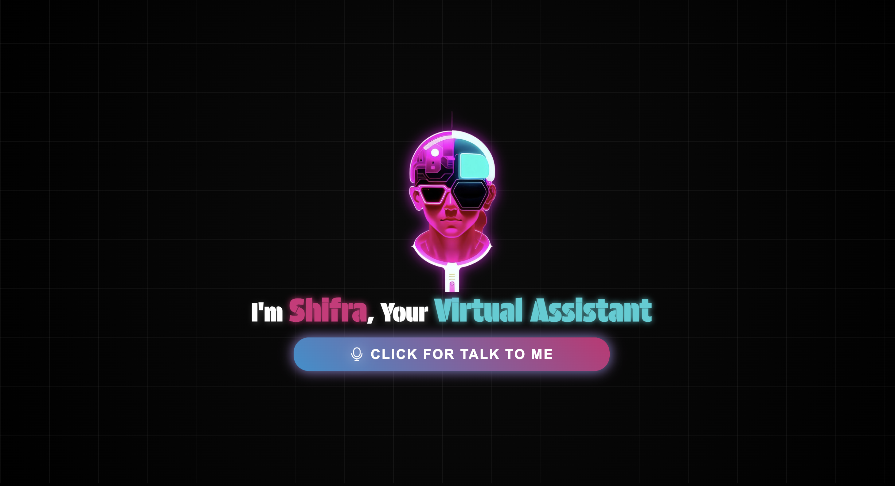

# Shifra - Virtual Assistant

Shifra is a **virtual assistant** built using **JavaScript, HTML, and CSS**. It leverages **speech recognition and text-to-speech** capabilities to interact with users, execute voice commands, and perform various tasks like opening websites.

## 🌟 Features

- 🎤 **Voice recognition** using JavaScript
- 🔊 **Text-to-speech** responses
- 🌐 **Supports multiple commands**, such as:
  - Open Google, YouTube, LinkedIn, Facebook, Instagram, Twitter, etc.
- 🎨 **Modern UI**

## 📸 Preview



## 🚀 How to Use

1. **Clone the repository:**
   ```bash
   git clone https://github.com/AnujGahra/Shifra-Virtual-Assistant
   ```
2. **Open `index.html` in your browser.**
3. Click on the microphone button 🎤 and start speaking commands.

## 🛠️ Technologies Used

- HTML
- CSS
- JavaScript
- Web Speech API

## 📌 Future Improvements

- Add more intelligent responses
- Enhance animations and UI/UX
- Integrate AI-based NLP for better understanding

## 💡 Contributing

Feel free to **fork** this repository, improve it, and submit a **pull request**! 😊


---
### 🔗 Connect with Me
- GitHub: [GitHubProfile](https://github.com/anujgahra)
- LinkedIn: [LinkedInProfile](https://linkedin.com/in/anujgahra)
